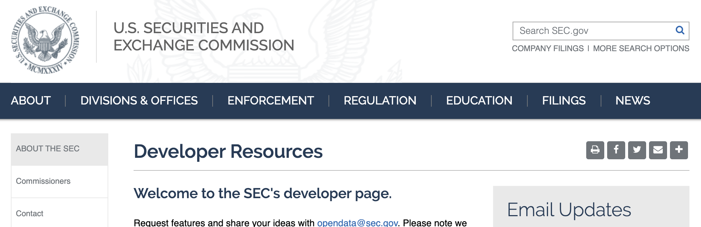
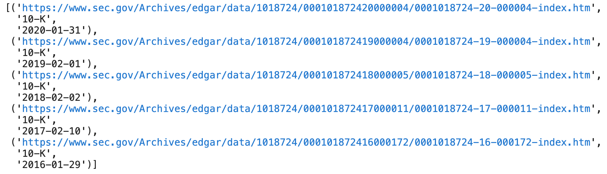
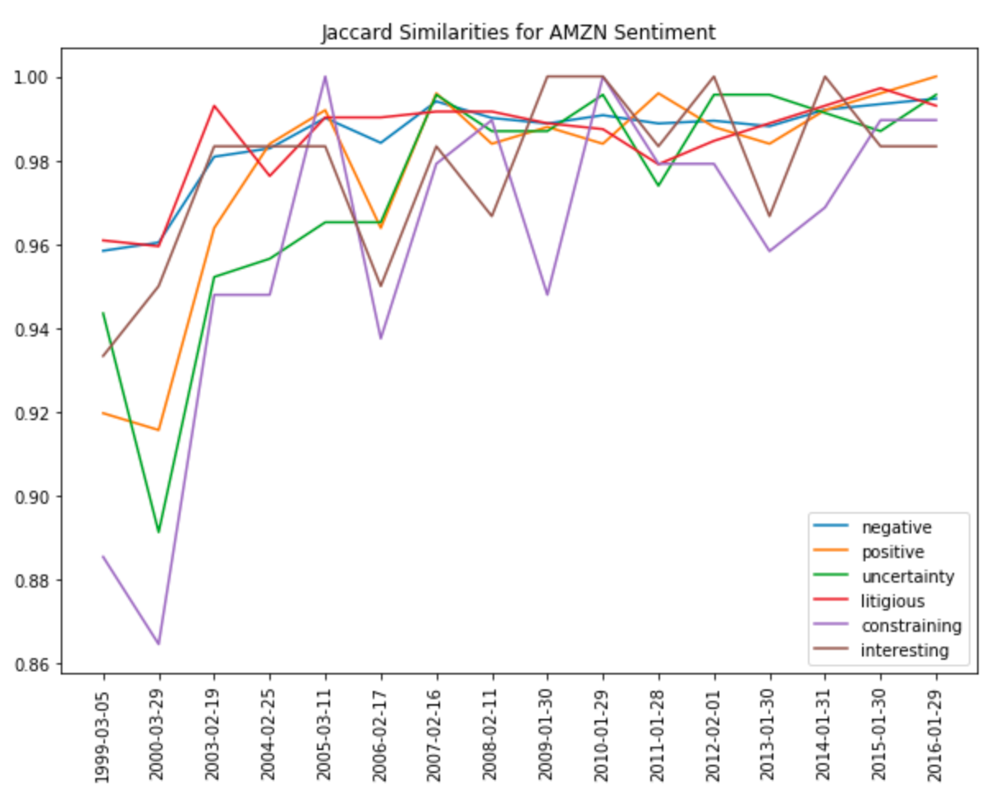
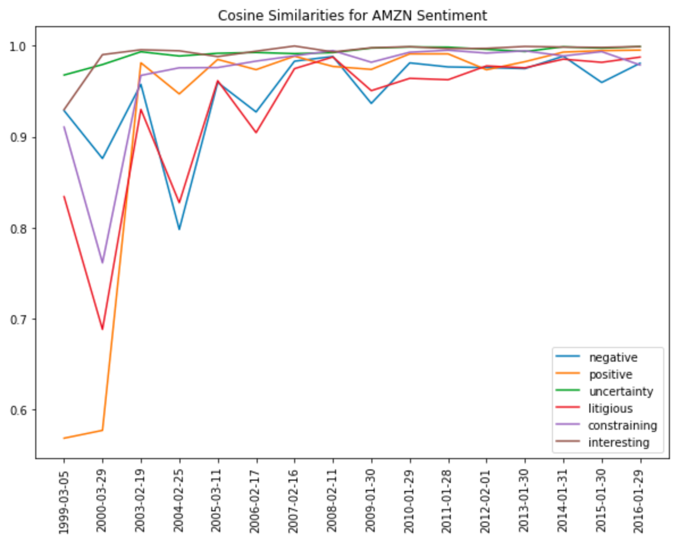

# NLP in Finance 

## PART 1: NLP on Financial Statements

In this project, I have done NLP anlaysis on **10-k financial statements** to generate an alpha factor. 

### Step 1:  Get list of `10-Ks`

1. Use  `request` moduel to extract `10-k` reports from `SEC` API. Download  10-Ks html files for a few companies based on their `CIK`.
   

   
   
   
   + One tricky thing is that `SEC` has a limit on the number of calls we can make to the website per second. In order to avoid hiting that limit, I have created the `SecAPI` class to cache data from the `SEC`.  
   
   
   
   
   
2. Use `re` for tags  (`<DOCUMENT>`, `</DOCUMENT>`, `<Type>`) to extract sections contain 10-information and create dictionary for 10-Ks. 

### Step 2:  Preprocess the data

1. The text for document are very messy,  we need to **clean up** by removing the html and lowering case all the text using `BeautifulSoup`. 
2. With text cleaned up, we need to **lemmatize** verbs in the list of words.
3. remove the **stopwords** 

### Step 3: Analysis on 10-Ks

#### Loughran McDonald Sentiment Word Lists

use the **Loughran and McDonald sentiment word lists** .  The word lists cover the following sentiment:`Negative`, `Positive`, `Uncertainty`, `Litigious`, `Constraining`, `Superfluous`, `Interesting`, `Modal`. We choose a few of them to do sentiment analysis on the 10-Ks.

#### Bag of Words

Using the sentiment word lists, we generate sentiment **bag of words** from 10-K documents. (ignore words are not in `sentiment_words`)

Use **bag of words**, calculate the **jaccard similarity** on the bag of words and plot it over time. 

+ Since the input, `bag_of_words_matrix`, is a bag of words for each time period in order, we just need to compute the jaccard similarities for each *neighboring* bag of words. 

#### TFIDF

use the sentiment word list, try to use alternative sentiment **TFIDF** model from 10-K documents. 

Then calculate the **cosine similarity** for each *neighboring* bag of words. 

In this part, I have done NLP Anlysis on 10-k financial statements to generate an alpha factor. For the dataset, I used the end of day from Quotemedia and Loughran-McDonald sentiment word lists.

## PART 2: Sentiment Analysis with Neural Networks 

In this part, I have built deep learning model to classify the sentiment of messages from [StockTwits](https://stocktwits.com/), a social network for investors and traders. My model is able to predict if any particular message is positive or negative. From this, I am able to generate a signal of the public sentiment for various ticker symbols.
